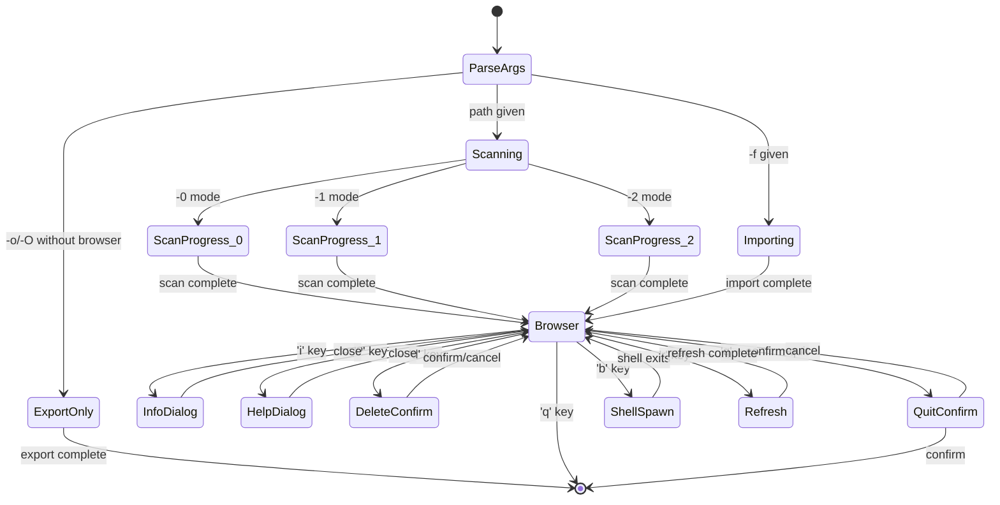
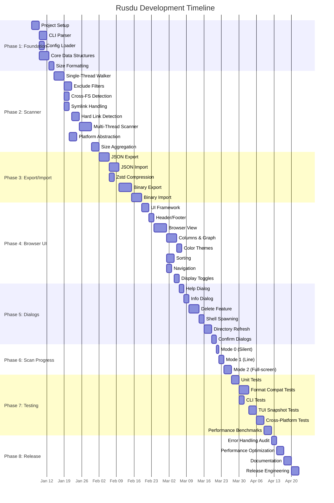

# 🦀 Rusdu — Rust Rewrite of ncdu 2.x

## Comprehensive Implementation Plan

> **Goal**: A 100% feature-compatible Rust rewrite of ncdu 2.x (targeting 2.9.x parity), named **rusdu**. Every CLI flag, keybinding, file format, and behavioral nuance must match ncdu 2.x.

---

## 1. Project Overview

### 1.1 What is ncdu?
NCurses Disk Usage (ncdu) is an interactive terminal-based disk usage analyzer. The 2.x series (written in Zig) adds parallel scanning, binary export format, Zstandard compression, and color themes.

### 1.2 Why Rewrite in Rust?
- **Memory safety guarantees** without garbage collection
- **Rich ecosystem** of battle-tested crates (ratatui, crossterm, rayon, serde)
- **Cross-platform support** (Linux, macOS, Windows, FreeBSD) via crossterm
- **Better tooling**: cargo, clippy, rustfmt, extensive testing frameworks
- **Community**: Larger contributor pool familiar with systems programming in Rust

### 1.3 Project Name
**`rusdu`** — Rust Disk Usage

---

## 2. Feature Compatibility Matrix

Every feature below must achieve **exact behavioral parity** with ncdu 2.9.x.

### 2.1 Core Operating Modes

| Mode | ncdu Flag | Description | Status |
|------|-----------|-------------|--------|
| Scan & Browse | `ncdu [path]` | Scan directory, open browser | ✅ |
| Export JSON | `-o <file>` | Scan and export JSON to file | ✅ |
| Export Binary | `-O <file>` | Scan and export binary format to file | ✅ |
| Import & Browse | `-f <file>` | Import JSON/binary file and browse | ✅ |
| Export to stdout | `-o -` / `-O -` | Pipe export data to stdout | ✅ |
| Import from stdin | `-f -` | Read JSON from stdin (JSON only) | ✅ |
| Format Conversion | `-f in.json -O out.ncdu` | Convert between JSON ↔ binary | ✅ |
| Help | `-h` / `--help` | Print help message | ✅ |
| Version | `-v` / `-V` / `--version` | Print version | ✅ |

### 2.2 Complete CLI Flags

#### Scan Options
| Flag | Long Form | Description |
|------|-----------|-------------|
| `-x` | `--one-file-system` | Don't cross filesystem boundaries |
| | `--cross-file-system` | Cross filesystem boundaries (default) |
| | `--exclude <PATTERN>` | Exclude files matching pattern (repeatable) |
| `-X` | `--exclude-from <FILE>` | Exclude patterns from file |
| | `--include-caches` | Include directories with CACHEDIR.TAG (default) |
| | `--exclude-caches` | Exclude directories with CACHEDIR.TAG |
| `-L` | `--follow-symlinks` | Follow symlinks (count target size) |
| | `--no-follow-symlinks` | Don't follow symlinks (default) |
| | `--include-kernfs` | Include Linux pseudo-filesystems (default) |
| | `--exclude-kernfs` | Exclude Linux pseudo-filesystems (/proc, /sys, etc.) |
| `-t` | `--threads <N>` | Number of scan threads (default: 1) |
| `-e` | `--extended` | Enable extended info (mtime, uid, gid, mode) |
| | `--no-extended` | Disable extended info (default) |

#### Export Options
| Flag | Long Form | Description |
|------|-----------|-------------|
| `-c` | `--compress` | Enable Zstandard compression for JSON export |
| | `--no-compress` | Disable compression (default for JSON) |
| | `--compress-level <N>` | Zstandard compression level: 1-19 (default: 4) |
| | `--export-block-size <N>` | Block size in KiB for binary format: 4-16000 |

#### UI Feedback Options
| Flag | Description |
|------|-------------|
| `-0` | No UI feedback during scan (default when exporting to stdout) |
| `-1` | Line-based progress (default when exporting to file) |
| `-2` | Full-screen ncurses scan UI (default for interactive) |
| `-q` / `--slow-ui-updates` | Update UI every 2 seconds |
| | `--fast-ui-updates` | Update UI 10 times/second (default) |

#### Feature Enable/Disable
| Flag | Description |
|------|-------------|
| `--enable-shell` | Enable shell spawning (default for live scan) |
| `--disable-shell` | Disable shell spawning (default for import) |
| `--enable-delete` | Enable file deletion (default for live scan) |
| `--disable-delete` | Disable file deletion (default for import) |
| `--enable-refresh` | Enable directory refresh (default for live scan) |
| `--disable-refresh` | Disable directory refresh (default for import) |
| `-r` | Read-only: once = `--disable-delete`, twice = also `--disable-shell` |

#### Display Options
| Flag | Description |
|------|-------------|
| `--si` | Use SI units (kB, MB = powers of 1000) |
| `--no-si` | Use binary units (KiB, MiB = powers of 1024, default) |
| `--disk-usage` | Show disk usage (default) |
| `--apparent-size` | Show apparent file sizes |
| `--show-hidden` / `--hide-hidden` | Show/hide hidden and excluded files (default: show) |
| `--show-itemcount` / `--hide-itemcount` | Show/hide item count column (default: hide) |
| `--show-mtime` / `--hide-mtime` | Show/hide mtime column (default: hide, requires `-e`) |
| `--show-graph` / `--hide-graph` | Show/hide relative size bar (default: show) |
| `--show-percent` / `--hide-percent` | Show/hide percentage column (default: show) |
| `--graph-style <STYLE>` | Graph drawing: `hash` (default), `half-block`, `eighth-block` |
| `--shared-column <MODE>` | `off`, `shared` (default), `unique` |
| `--sort <COLUMN>` | Sort: `disk-usage` (default), `name`, `apparent-size`, `itemcount`, `mtime` |
| | Suffix with `-asc` or `-desc` for order |
| `--enable-natsort` / `--disable-natsort` | Natural sort for filenames (default: enable) |
| `--group-directories-first` | Sort directories before files |
| `--no-group-directories-first` | Don't group directories (default) |

#### Safety & Behavior
| Flag | Description |
|------|-------------|
| `--confirm-quit` | Require confirmation before quitting |
| `--no-confirm-quit` | Quit immediately on 'q' (default) |
| `--confirm-delete` | Require confirmation before deletion (default) |
| `--no-confirm-delete` | Delete without confirmation |
| `--delete-command <CMD>` | Custom shell command for deletion |
| `--color <SCHEME>` | Color scheme: `off` (default), `dark`, `dark-bg` |
| `--ignore-config` | Don't load config files |

### 2.3 Interactive Keybindings

#### Navigation
| Key | Action |
|-----|--------|
| `↑` / `k` | Move cursor up |
| `↓` / `j` | Move cursor down |
| `→` / `Enter` / `l` | Open selected directory |
| `←` / `h` / `Backspace` | Go to parent directory |
| `Page Up` | Page up |
| `Page Down` | Page down |
| `Home` | Jump to first item |
| `End` | Jump to last item |

#### Sorting
| Key | Action |
|-----|--------|
| `n` | Sort by name (press again for descending) |
| `s` | Sort by size / disk usage (press again for descending) |
| `C` | Sort by item count (press again for descending) |
| `M` | Sort by mtime (press again for descending, requires `-e`) |

#### Display Toggles
| Key | Action |
|-----|--------|
| `a` | Toggle disk usage ↔ apparent size |
| `g` | Cycle: percentage + graph → percentage only → graph only → none |
| `u` | Cycle shared column: off → shared → unique |
| `c` | Toggle item count column |
| `m` | Toggle mtime column (requires `-e`) |
| `e` | Toggle hidden/excluded files visibility |
| `t` | Toggle directories-before-files sorting |

#### Actions
| Key | Action |
|-----|--------|
| `d` | Delete selected file/directory |
| `b` | Spawn shell in current directory |
| `r` | Refresh/recalculate current directory |
| `i` | Show info about selected item |
| `?` / `F1` | Open help screen |
| `q` | Quit (or close dialog/go back) |

### 2.4 File Flags (Browser Display)

| Symbol | Internal Name | Meaning |
|--------|--------------|---------|
| `!` | `read_error` | Error reading this directory |
| `.` | `sub_error` | Error reading a subdirectory (size may be inaccurate) |
| `<` | `excluded` | Excluded from statistics by exclude pattern |
| `>` | `other_fs` | Directory is on another filesystem |
| `F` | `kernfs` | Excluded pseudo-filesystem (Linux) |
| `@` | `notreg` | Not a regular file/directory (symlink, socket, etc.) |
| `H` | `hlnkc` | Hard link (already counted) |
| `e` | `empty` | Empty directory |

---

## 3. Architecture Design

### 3.1 High-Level Module Structure

```
rusdu/
├── Cargo.toml
├── src/
│   ├── main.rs                  # Entry point, CLI parsing
│   ├── cli.rs                   # CLI argument definitions (clap)
│   ├── config.rs                # Configuration file loading
│   ├── scan/
│   │   ├── mod.rs               # Scanner public API
│   │   ├── walker.rs            # Single-threaded filesystem walker
│   │   ├── parallel.rs          # Multi-threaded parallel scanner
│   │   ├── entry.rs             # FileEntry / DirEntry types
│   │   ├── filter.rs            # Exclude patterns, CACHEDIR.TAG, kernfs
│   │   └── platform.rs          # Platform-specific stat calls
│   ├── tree/
│   │   ├── mod.rs               # In-memory tree structure
│   │   ├── node.rs              # TreeNode (file/dir with metadata)
│   │   ├── arena.rs             # Arena allocator for nodes
│   │   ├── stats.rs             # Size aggregation, hard link dedup
│   │   └── sort.rs              # Sorting logic (name, size, count, mtime)
│   ├── export/
│   │   ├── mod.rs               # Export dispatcher
│   │   ├── json_write.rs        # JSON export writer
│   │   ├── json_read.rs         # JSON import reader
│   │   ├── bin_write.rs         # Binary format writer
│   │   ├── bin_read.rs          # Binary format reader
│   │   └── compress.rs          # Zstandard compression wrapper
│   ├── ui/
│   │   ├── mod.rs               # UI manager / app state machine
│   │   ├── browser.rs           # Main file browser view
│   │   ├── scan_progress.rs     # Scanning progress display (-2 mode)
│   │   ├── line_progress.rs     # Line-based progress (-1 mode)
│   │   ├── info_dialog.rs       # Item info dialog (i key)
│   │   ├── help_dialog.rs       # Help/about screen (? key)
│   │   ├── confirm_dialog.rs    # Confirmation dialogs (delete, quit)
│   │   ├── error_dialog.rs      # Error display
│   │   ├── header.rs            # Top bar (path, totals)
│   │   ├── footer.rs            # Bottom bar (help hints)
│   │   ├── columns.rs           # Column rendering (size, graph, %, count, mtime)
│   │   ├── graph.rs             # Size bar rendering (hash, half-block, eighth-block)
│   │   └── theme.rs             # Color schemes (off, dark, dark-bg)
│   ├── delete.rs                # File/directory deletion logic
│   ├── shell.rs                 # Shell spawning (NCDU_SHELL, NCDU_LEVEL)
│   ├── format.rs                # Size formatting (SI vs binary units)
│   ├── natsort.rs               # Natural sort implementation
│   └── util.rs                  # Shared utilities
├── tests/
│   ├── integration/
│   │   ├── cli_tests.rs         # CLI flag parsing tests
│   │   ├── scan_tests.rs        # Filesystem scanning tests
│   │   ├── json_compat.rs       # JSON format compatibility tests
│   │   ├── bin_compat.rs        # Binary format compatibility tests
│   │   └── ui_tests.rs          # TUI snapshot tests
│   └── fixtures/                # Test data files
│       ├── sample.json          # ncdu JSON export for testing
│       └── sample.ncdu          # ncdu binary export for testing
└── benches/
    ├── scan_bench.rs            # Scanning benchmarks
    └── sort_bench.rs            # Sorting benchmarks
```

### 3.2 Core Data Structures

```rust
/// Represents a single entry in the filesystem tree
pub struct TreeNode {
    /// File/directory name (not full path)
    pub name: Box<str>,
    /// Apparent size in bytes
    pub asize: i64,
    /// Disk usage in bytes
    pub dsize: i64,
    /// Device number (for cross-filesystem detection)
    pub dev: u64,
    /// Inode number (for hard link detection)
    pub ino: u64,
    /// Hard link count
    pub nlink: u32,
    /// Entry flags
    pub flags: EntryFlags,
    /// Extended info (optional, only with -e)
    pub extended: Option<ExtendedInfo>,
    /// Children (dirs only) - indices into arena
    pub children: Option<Vec<NodeId>>,
    /// Parent index
    pub parent: Option<NodeId>,
    /// Aggregated stats
    pub stats: AggregateStats,
}

bitflags! {
    pub struct EntryFlags: u16 {
        const IS_DIR       = 0b0000_0001;
        const READ_ERROR   = 0b0000_0010;  // '!'
        const SUB_ERROR    = 0b0000_0100;  // '.'
        const EXCLUDED     = 0b0000_1000;  // '<'
        const OTHER_FS     = 0b0001_0000;  // '>'
        const KERNFS       = 0b0010_0000;  // 'F'
        const NOT_REG      = 0b0100_0000;  // '@'
        const HARD_LINK    = 0b1000_0000;  // 'H'
        const EMPTY_DIR    = 0b1_0000_0000; // 'e'
    }
}

pub struct ExtendedInfo {
    pub mtime: i64,     // Unix timestamp
    pub uid: u32,
    pub gid: u32,
    pub mode: u32,
}

pub struct AggregateStats {
    pub total_asize: i64,    // Sum of apparent sizes
    pub total_dsize: i64,    // Sum of disk usage
    pub item_count: u32,     // Total items (recursive)
    pub dir_count: u32,      // Total directories
    pub file_count: u32,     // Total files
    pub latest_mtime: i64,   // Latest child mtime
    pub shared_size: i64,    // Shared hard link size
}

/// Node identifier — index into the arena
#[derive(Copy, Clone, Debug, Eq, PartialEq, Hash)]
pub struct NodeId(u32);

/// Arena allocator for tree nodes
pub struct TreeArena {
    nodes: Vec<TreeNode>,
    root: NodeId,
}
```

### 3.3 Application State Machine



---

## 4. Crate Dependencies

### 4.1 Core Dependencies

| Crate | Version | Purpose | Justification |
|-------|---------|---------|---------------|
| `clap` | 4.x | CLI argument parsing | Derive macros, subcommands, comprehensive validation |
| `ratatui` | 0.29+ | Terminal UI framework | Active successor of tui-rs, rich widget set |
| `crossterm` | 0.28+ | Cross-platform terminal I/O | Windows + Unix, no ncurses dependency |
| `serde` | 1.x | Serialization framework | For JSON format compatibility |
| `serde_json` | 1.x | JSON parsing/writing | ncdu JSON format support |
| `zstd` | 0.13+ | Zstandard compression | Bindings to libzstd for export compression |
| `rayon` | 1.x | Data parallelism | Multi-threaded scanning (`-t` flag) |
| `jwalk` | 0.8+ | Parallel directory walker | High-performance parallel traversal |
| `bitflags` | 2.x | Flag types | Entry flags, sort options |
| `nix` | 0.29+ | Unix API bindings | stat, statvfs, symlinks (Unix only) |
| `windows-sys` | 0.59+ | Windows API | File info on Windows |
| `glob` | 0.3+ | Pattern matching | Exclude pattern support |
| `dirs` | 6.x | Standard directories | Config file paths |
| `natord` | 1.x | Natural sort | Natural sort by filename |
| `chrono` | 0.4+ | DateTime formatting | mtime display |
| `anyhow` | 1.x | Error handling | Application-level error management |
| `thiserror` | 2.x | Error types | Library-level typed errors |
| `unicode-width` | 0.2+ | Unicode display widths | Correct column alignment for CJK, etc. |
| `log` | 0.4+ | Logging facade | Debug logging |
| `env_logger` | 0.11+ | Logger impl | Development logging |

### 4.2 Cargo.toml Skeleton

```toml
[package]
name = "rusdu"
version = "0.1.0"
edition = "2024"
description = "Rust rewrite of ncdu — NCurses Disk Usage analyzer"
license = "MIT"
rust-version = "1.85"

[dependencies]
clap = { version = "4", features = ["derive"] }
ratatui = { version = "0.29", default-features = false, features = ["crossterm"] }
crossterm = "0.28"
serde = { version = "1", features = ["derive"] }
serde_json = "1"
zstd = "0.13"
rayon = "1"
jwalk = "0.8"
bitflags = "2"
glob = "0.3"
dirs = "6"
natord = "1.0"
chrono = { version = "0.4", default-features = false, features = ["clock"] }
anyhow = "1"
thiserror = "2"
unicode-width = "0.2"
log = "0.4"

[target.'cfg(unix)'.dependencies]
nix = { version = "0.29", features = ["fs", "process"] }

[target.'cfg(windows)'.dependencies]
windows-sys = { version = "0.59", features = ["Win32_Storage_FileSystem", "Win32_Foundation"] }

[dev-dependencies]
tempfile = "3"
assert_cmd = "2"
predicates = "3"
insta = "1"    # Snapshot testing for TUI

[profile.release]
lto = true
codegen-units = 1
strip = true
```

---

## 5. Detailed Implementation Plan

### Phase 1: Foundation (Weeks 1-2)

> **Goal**: Project scaffolding, CLI parsing, configuration loading, basic data structures.

#### Tasks

- [ ] **1.1 — Project Setup**
  - Initialize Cargo project with workspace structure
  - Set up CI (GitHub Actions: Linux, macOS, Windows)
  - Configure clippy, rustfmt, deny(unsafe_code) policy
  - Set up integration test framework

- [ ] **1.2 — CLI Argument Parser** (`cli.rs`)
  - Define all CLI flags using clap derive macros
  - Implement `-r` flag counter (once = disable-delete, twice = also disable-shell)
  - Validate mutually exclusive options
  - Handle positional path argument with default to CWD
  - Handle `-o -` and `-f -` (stdout/stdin special cases)

- [ ] **1.3 — Configuration File Loader** (`config.rs`)
  - Parse `/etc/ncdu.conf` and `$HOME/.config/ncdu/config`
  - Support one option per line, `#` comments, `@` prefix for error suppression
  - Merge: system config → user config → CLI args (CLI wins)
  - Implement `--ignore-config`

- [ ] **1.4 — Core Data Structures** (`tree/`)
  - Implement `TreeNode`, `NodeId`, `EntryFlags`, `ExtendedInfo`, `AggregateStats`
  - Implement `TreeArena` with arena allocation
  - Implement tree traversal (parent, children, depth-first, breadth-first)
  - Unit tests for tree operations

- [ ] **1.5 — Size Formatting** (`format.rs`)
  - Binary units: B, KiB, MiB, GiB, TiB, PiB, EiB
  - SI units: B, kB, MB, GB, TB, PB, EB
  - Match ncdu's exact formatting (field widths, decimal places)
  - Handle signed 64-bit integer sizes (max 8 EiB - 1)

---

### Phase 2: Filesystem Scanner (Weeks 3-4)

> **Goal**: Complete single-threaded and multi-threaded filesystem scanning.

#### Tasks

- [ ] **2.1 — Single-Threaded Walker** (`scan/walker.rs`)
  - Recursive directory traversal using `std::fs`
  - Collect: name, asize (file size), dsize (blocks × block_size), ino, dev, nlink
  - Extended mode (`-e`): also collect uid, gid, mode, mtime
  - Build in-memory `TreeArena` during walk

- [ ] **2.2 — Exclude Filters** (`scan/filter.rs`)
  - `--exclude <PATTERN>`: glob pattern matching against file/dir names
  - `--exclude-from <FILE>`: load patterns from file (one per line)
  - `--exclude-caches`: detect `CACHEDIR.TAG` files (check first 43 bytes)
  - `--exclude-kernfs`: detect Linux pseudo-filesystems by fs type
  - Mark excluded entries with appropriate flags (still display, don't count)

- [ ] **2.3 — Cross-Filesystem Detection**
  - `-x` / `--one-file-system`: compare dev numbers
  - Mark cross-fs directories with `OTHER_FS` flag
  - Don't recurse into other filesystems, but still display entry

- [ ] **2.4 — Symlink Handling**
  - `--follow-symlinks`: use `stat()` instead of `lstat()` for symlinks
  - `--no-follow-symlinks` (default): use `lstat()`, mark as `NOT_REG`
  - Never follow symlinks to directories

- [ ] **2.5 — Hard Link Detection**
  - Track (dev, ino) pairs in a `HashMap`
  - When nlink > 1 and (dev, ino) already seen: set `HARD_LINK` flag
  - Calculate shared vs. unique sizes for directories

- [ ] **2.6 — Multi-Threaded Scanner** (`scan/parallel.rs`)
  - Use `jwalk` or custom thread pool with `rayon`
  - `-t <N>` threads (default 1)
  - Thread-safe tree building with per-thread buffers
  - Merge thread-local results into global `TreeArena`

- [ ] **2.7 — Platform Abstraction** (`scan/platform.rs`)
  - Unix: `libc::stat`, `statvfs` for filesystem detection
  - Linux-specific: `/proc/mounts` or `statfs` for kernfs detection
  - Windows: `GetFileInformationByHandle`, volume serial numbers
  - macOS: handle firmlinks (known limitation — not detected as hard links)

- [ ] **2.8 — Size Aggregation** (`tree/stats.rs`)
  - Post-scan bottom-up aggregation of directory sizes
  - Calculate `total_asize`, `total_dsize`, `item_count`
  - Calculate `latest_mtime` for directories (recursive)
  - Calculate shared/unique sizes based on hard link detection
  - Handle 64-bit overflow clamping (cap at i64::MAX)

---

### Phase 3: Export & Import (Weeks 5-6)

> **Goal**: Full compatibility with ncdu's JSON and binary export formats.

#### Tasks

- [ ] **3.1 — JSON Export Writer** (`export/json_write.rs`)
  - Output format: `[1, 2, {metadata}, [dir_info, children...]]`
  - Major version: 1, Minor version: 2
  - Metadata: `{"progname": "rusdu", "progver": "...", "timestamp": <unix_ts>}`
  - Directory: JSON array with info object first, then children
  - Info object fields: `name`, `asize`, `dsize`, `ino`, `nlink` (always)
  - Extended fields: `uid`, `gid`, `mode`, `mtime` (when `-e`)
  - Special fields: `read_error`, `excluded`, `notreg`, `hlnkc`, `othfs`, `kernfs`
  - Single-threaded: streaming write (low memory)
  - Multi-threaded: buffer in memory, write after scan
  - Support `-o -` (stdout)

- [ ] **3.2 — JSON Import Reader** (`export/json_read.rs`)
  - Streaming JSON parser for large files
  - Handle version checking (major must be 1, minor 0-2)
  - Build `TreeArena` from parsed data
  - Support `-f -` (stdin)
  - Gracefully handle missing optional fields

- [ ] **3.3 — Zstandard Compression** (`export/compress.rs`)
  - `-c` / `--compress`: wrap JSON output in zstd compression
  - `--compress-level <N>`: levels 1-19 (default 4)
  - Auto-detect compressed input on import (check zstd magic bytes)
  - Use `zstd` crate for compression/decompression

- [ ] **3.4 — Binary Format Writer** (`export/bin_write.rs`)
  - File signature: `\xbfncduEX1`
  - Block format: 4-byte TypeLen (high 4 bits = type, low 28 bits = length)
  - Data blocks (type 0): block number + zstd-compressed content
  - Index block (type 1): must be last block
  - TypeLen repeated at end of block (allows bidirectional reading)
  - `--export-block-size <N>`: configurable block size (4-16000 KiB, default adaptive starting at 64 KiB)
  - Support multi-threaded export with thread-local buffering
  - Include cumulative directory sizes in export

- [ ] **3.5 — Binary Format Reader** (`export/bin_read.rs`)
  - Parse file signature
  - Read blocks in forward direction
  - Read index block to enable random-access browsing
  - Support browsing without loading entire tree into memory
  - Decompress data blocks on demand

---

### Phase 4: Terminal UI — Browser (Weeks 7-9)

> **Goal**: Complete interactive file browser with all display modes and keybindings.

#### Tasks

- [ ] **4.1 — UI Framework Setup** (`ui/mod.rs`)
  - Initialize crossterm raw mode
  - Set up ratatui terminal backend
  - Main event loop: key events + periodic refresh (10Hz or 0.5Hz)
  - Graceful cleanup on exit (restore terminal state)
  - Handle terminal resize events

- [ ] **4.2 — Header Bar** (`ui/header.rs`)
  - Display format: `ncdu <version> ~ Use the arrow keys to navigate, press ? for help`
  - Show current path breadcrumb
  - Show total size and item count for current directory

- [ ] **4.3 — Footer Bar** (`ui/footer.rs`)
  - Display: `Total disk usage: <size>  Apparent size: <size>  Items: <count>`
  - Context-sensitive hints

- [ ] **4.4 — File Browser View** (`ui/browser.rs`)
  - Scrollable list of entries in current directory
  - Columns (left to right):
    1. File flag character (single char)
    2. Size column (right-aligned, formatted)
    3. Shared/unique size column (optional, toggled with `u`)
    4. Item count column (optional, toggled with `c`)
    5. Mtime column (optional, toggled with `m`, requires `-e`)
    6. Graph bar (optional, toggled with `g`)
    7. Percentage (optional, toggled with `g`)
    8. Filename
  - Highlight selected row
  - Handle scrolling with cursor tracking
  - Directory entries shown with `/` suffix

- [ ] **4.5 — Column Rendering** (`ui/columns.rs`)
  - Size column: right-aligned with unit suffix
  - Graph bar: relative to largest item in current directory
  - Percentage: relative to parent directory size
  - Item count: right-aligned integer
  - Mtime: formatted datetime string

- [ ] **4.6 — Graph Bar Rendering** (`ui/graph.rs`)
  - `hash` style: `#` characters (most portable)
  - `half-block` style: `▌` half-block characters
  - `eighth-block` style: `▏▎▍▌▋▊▉█` eighth-block characters (most precise)
  - Scale relative to largest item in directory

- [ ] **4.7 — Color Themes** (`ui/theme.rs`)
  - `off`: No colors (default)
  - `dark`: Color scheme for dark terminal backgrounds
  - `dark-bg`: Variant that also works on light backgrounds
  - Map colors to ratatui `Style` objects
  - Apply to: header, footer, selected item, directories, size thresholds

- [ ] **4.8 — Sorting** (`tree/sort.rs`)
  - Sort by: name, disk-usage, apparent-size, itemcount, mtime
  - Ascending/descending toggle (press same key twice)
  - Natural sort for filenames (`--enable-natsort`)
  - Group directories first option (`--group-directories-first`, `t` key)
  - Re-sort on toggle, maintain cursor position

- [ ] **4.9 — Navigation**
  - `↑`/`k`, `↓`/`j`: Move cursor
  - `→`/`Enter`/`l`: Enter directory
  - `←`/`h`/`Backspace`: Go to parent
  - `Page Up`/`Page Down`: Page scroll
  - `Home`/`End`: Jump to first/last
  - Track navigation history for parent cursor position restoration

- [ ] **4.10 — Display Toggles**
  - `a`: Toggle disk usage ↔ apparent size
  - `g`: Cycle graph display: both → percent only → graph only → none
  - `u`: Cycle shared column: off → shared → unique
  - `c`: Toggle item count column
  - `m`: Toggle mtime column
  - `e`: Toggle hidden/excluded visibility
  - `t`: Toggle directories-before-files

---

### Phase 5: Dialogs & Actions (Weeks 10-11)

> **Goal**: All interactive features — info, help, delete, shell, refresh.

#### Tasks

- [ ] **5.1 — Help Dialog** (`ui/help_dialog.rs`)
  - `?` / `F1` to open
  - Multi-page: Keys, Format (file flags), About
  - Display all keybindings with descriptions
  - Display file flag meanings
  - Display version and attribution
  - Navigate pages, `q` or `?` to close

- [ ] **5.2 — Item Info Dialog** (`ui/info_dialog.rs`)
  - `i` to open
  - Display: full path, type, size (disk + apparent), item count
  - Extended info: permissions, ownership (uid/gid), mtime
  - Hard link info: link count, shared/unique sizes
  - Display file flags
  - `q` or `i` to close

- [ ] **5.3 — Delete Functionality** (`delete.rs`, `ui/confirm_dialog.rs`)
  - `d` key triggers deletion
  - `--confirm-delete` (default): show confirmation dialog
  - `--no-confirm-delete`: delete immediately
  - Built-in deletion: recursive `rm -rf` equivalent
  - Custom deletion: `--delete-command <CMD>`
    - Append absolute path to command
    - Set `NCDU_DELETE_PATH` environment variable
    - Set `NCDU_LEVEL` environment variable
    - Execute in shell, wait for completion
  - After deletion: refresh in-memory view, adjust parent sizes
  - Error handling: show error if item changed/missing on disk
  - Verify directory contents match before deleting

- [ ] **5.4 — Shell Spawning** (`shell.rs`)
  - `b` key spawns shell
  - Shell resolution: `$NCDU_SHELL` → `$SHELL` → `/bin/sh`
  - Set/increment `NCDU_LEVEL` environment variable
  - Working directory: currently browsed directory
  - Suspend TUI, restore on shell exit
  - `--enable-shell` / `--disable-shell` control

- [ ] **5.5 — Directory Refresh**
  - `r` key triggers rescan of current directory
  - Re-walk directory tree from current position
  - Update in-memory tree with new sizes
  - Propagate size changes to parent directories
  - `--enable-refresh` / `--disable-refresh` control

- [ ] **5.6 — Confirm Quit Dialog**
  - `q` key with `--confirm-quit`: show "Really quit?" dialog
  - `q` key without `--confirm-quit`: quit immediately
  - Also handle Ctrl+C gracefully

---

### Phase 6: Scan Progress UI (Week 12)

> **Goal**: All three scanning feedback modes.

#### Tasks

- [ ] **6.1 — Mode 0 (`-0`)** — Silent
  - No UI output during scan
  - Only fatal errors printed to stderr
  - Default when exporting to stdout

- [ ] **6.2 — Mode 1 (`-1`)** — Line Progress
  - Print progress to terminal without full-screen UI
  - Show: items scanned, current path, elapsed time
  - Overwrite single line with `\r`
  - Default when exporting to file

- [ ] **6.3 — Mode 2 (`-2`)** — Full-Screen Progress
  - Full ratatui UI during scan
  - Show: items scanned, total size so far, current path, elapsed time
  - Display non-fatal errors (permission denied, etc.) in scrollable list
  - Allow `q` to abort scan
  - Default for interactive use
  - Handle `--slow-ui-updates` (2s interval) / `--fast-ui-updates` (100ms interval)

---

### Phase 7: Testing & Compatibility (Weeks 13-14)

> **Goal**: Comprehensive test suite ensuring ncdu compatibility.

#### Tasks

- [ ] **7.1 — Unit Tests**
  - Tree operations: insert, aggregate, sort
  - Size formatting: all unit combinations
  - Natural sort: edge cases (numbers, Unicode)
  - Filter matching: glob patterns
  - Config parsing: all options

- [ ] **7.2 — JSON Format Compatibility Tests**
  - Generate JSON with ncdu, import with rusdu → verify tree matches
  - Generate JSON with rusdu, import with ncdu → verify ncdu accepts it
  - Test all JSON fields: name, asize, dsize, ino, nlink, uid, gid, mode, mtime
  - Test flags: read_error, excluded, notreg, hlnkc, othfs, kernfs
  - Test edge cases: empty dirs, deep nesting, Unicode filenames, huge files

- [ ] **7.3 — Binary Format Compatibility Tests**
  - Generate binary with ncdu, import with rusdu → verify tree matches
  - Generate binary with rusdu, import with ncdu → verify ncdu accepts it
  - Test block format: signatures, TypeLen encoding, data/index blocks
  - Test compression levels
  - Test large exports (millions of files)

- [ ] **7.4 — CLI Compatibility Tests**
  - Test every flag combination
  - Test flag precedence (config file → CLI)
  - Test `-r` (once and twice)
  - Test `--delete-command` with custom commands
  - Test stdin/stdout piping

- [ ] **7.5 — TUI Snapshot Tests**
  - Use `insta` for snapshot testing
  - Capture rendered output for: browser view, dialogs, progress screens
  - Test column toggling (all combinations of g, c, m, u)
  - Test sorting (all columns, ascending/descending)
  - Test color themes

- [ ] **7.6 — Cross-Platform Tests**
  - Linux: full feature set including kernfs
  - macOS: no kernfs, handle firmlinks caveat
  - Windows: adapted filesystem detection, no shell spawning via `/bin/sh`
  - FreeBSD: POSIX compatibility

- [ ] **7.7 — Performance Benchmarks**
  - Single-threaded scan: compare with ncdu 2.9
  - Multi-threaded scan: compare with ncdu 2.9 at various thread counts
  - Memory usage: compare tree memory footprint
  - Export speed: JSON and binary formats
  - Import speed: JSON and binary formats
  - Large directory trees: 1M, 10M, 100M files

---

### Phase 8: Polish & Release (Weeks 15-16)

> **Goal**: Production readiness.

#### Tasks

- [ ] **8.1 — Error Handling Audit**
  - No panics in release mode
  - Graceful handling of all I/O errors
  - Meaningful error messages to users
  - Terminal state always restored on crash

- [ ] **8.2 — Performance Optimization**
  - Profile and optimize hot paths (scanning, sorting)
  - Minimize allocations in scan loop
  - Optimize tree memory layout for cache friendliness
  - Lazy sorting (only sort visible directory)

- [ ] **8.3 — Documentation**
  - Complete man page (compatible with ncdu's format)
  - `--help` output matching ncdu
  - README with installation, usage, compatibility notes
  - CHANGELOG
  - Contributing guide

- [ ] **8.4 — Release Engineering**
  - Cross-compilation targets: x86_64/aarch64 for Linux, macOS, Windows
  - Static linking (musl for Linux)
  - Binary size optimization
  - Cargo packaging for crates.io
  - Package manager recipes: Homebrew, AUR, Scoop, Nix

---

## 6. Key Design Decisions

### 6.1 Arena Allocation for Tree Nodes
ncdu stores the directory tree in memory using a custom allocator. We use an arena (indexed `Vec<TreeNode>`) for:
- Cache-friendly memory layout
- O(1) node access by ID
- No reference counting overhead
- Easy serialization

### 6.2 Crossterm over ncurses
ncdu 2.x uses Zig's standard library for terminal I/O. We use crossterm because:
- Pure Rust, no C dependencies
- Native Windows support
- Active maintenance as ratatui's primary backend

### 6.3 Streaming vs. In-Memory Processing
- **Single-threaded scan + JSON export**: Stream directly to file (minimal memory)
- **Multi-threaded scan + JSON export**: Build tree in memory first, then write
- **Binary export**: Always supports streaming with thread-local buffers
- **Import**: JSON streams into memory; binary supports lazy loading via index block

### 6.4 Hard Link Tracking
- Use `HashMap<(u64, u64), NodeId>` mapping `(dev, ino)` to first occurrence
- When nlink > 1 and pair already seen: mark `HARD_LINK`, don't double-count
- Track shared/unique sizes per directory subtree

### 6.5 Natural Sort
Implement natural sort (treating numeric substrings as numbers) to match ncdu's `--enable-natsort` default. Use the `natord` crate or implement custom comparator matching ncdu's Zig implementation.

---

## 7. Compatibility Edge Cases

> [!IMPORTANT]
> These edge cases must be handled identically to ncdu 2.x.

| Edge Case | ncdu Behavior | Implementation |
|-----------|---------------|----------------|
| Sizes > 8 EiB | Clamp to `i64::MAX` | Use `i64` with saturation |
| Item counts > 4 billion | Wrap at `u32::MAX` | Use `u32` for item counts |
| Filenames with multibyte chars | Minor display glitches | Use `unicode-width` for column calculation |
| Hard link count changes during scan | Shared/unique sizes incorrect | Document as known limitation |
| Directory hard links (macOS firmlinks) | Not detected, scanned multiple times | Document as known limitation |
| Permission denied during scan | Mark with `!` flag, continue | Set `READ_ERROR` flag, don't recurse |
| Subdirectory error | Mark parent with `.` flag | Propagate `SUB_ERROR` to parent chain |
| Empty directories | Mark with `e` flag | Check children count == 0 after scan |
| Deleted files during scan | Stale data shown | Handle ENOENT gracefully |
| CACHEDIR.TAG detection | Check first 43 bytes: `Signature: 8a477f597d28d172789f06886806bc55` | Read and compare tag content |
| Config file with `@` prefix | Suppress errors for that option | Try parsing, ignore errors if `@` prefix |
| `/bin/sh` fallback for shell | Try `$NCDU_SHELL`, `$SHELL`, `/bin/sh` | Same priority order |
| `NCDU_LEVEL` env variable | Set or increment before shell spawn | Parse, increment, set in child env |

---

## 8. Risk Analysis

| Risk | Severity | Mitigation |
|------|----------|------------|
| Binary format spec incomplete in docs | High | Test against ncdu's actual output, study Zig source |
| Performance regression vs. Zig | Medium | Benchmark early and often, profile hot paths |
| Windows compatibility gaps | Medium | Use conditional compilation, test on CI |
| ratatui rendering differences vs. ncurses | Low | Snapshot tests against ncdu screenshots |
| Zstd crate compatibility | Low | Use well-maintained `zstd` crate with pinned version |
| Memory usage higher than ncdu | Medium | Arena allocation, measure and compare |

---

## 9. Timeline Summary



---

## 10. Success Criteria

- [ ] All ncdu 2.9.x CLI flags accepted and behave identically
- [ ] All interactive keybindings work identically
- [ ] JSON export/import fully interoperable with ncdu 2.9.x
- [ ] Binary export/import fully interoperable with ncdu 2.9.x
- [ ] Configuration files in same format, same locations
- [ ] All file flags displayed correctly
- [ ] All display modes (graph styles, shared column, etc.) render correctly
- [ ] Multi-threaded scanning works correctly
- [ ] Deletion works (built-in and custom command)
- [ ] Shell spawning works with NCDU_SHELL, SHELL, NCDU_LEVEL
- [ ] Performance within 20% of ncdu 2.9.x for single-threaded operations
- [ ] Passes on Linux, macOS, and Windows
- [ ] Zero panics in release mode under normal operation
